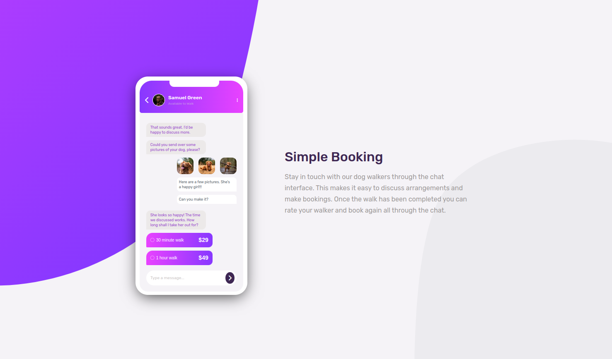

# Frontend Mentor - Chat App CSS illustration Solution

This is a solution to the [Chat app CSS illustration challenge on Frontend Mentor](https://www.frontendmentor.io/challenges/chat-app-css-illustration-O5auMkFqY). This project focused on CSS to create a realistic and interactive chat application interface. The design heavily emphasizes the creation of complex shapes and animations to mimic the look and feel of a real-world iPhone screen.
The display includes a phone shape complete with chat details, and a dynamic display that mimics text messages appearing on screen.

## Live Site

You can view the live site [Here](https://dev-jlagunas.github.io/visual-chat/)

## Table of contents

- [Overview](#overview)
  - [The challenge](#the-challenge)
  - [Screenshot](#screenshot)
- [My process](#my-process)
  - [Built with](#built-with)
  - [What I learned](#what-i-learned)
- [Author](#author) -[Contact](#contact)
- [Acknowledgments](#acknowledgments)

## Overview

### The challenge

Users should be able to:

- View the optimal layout for the app depending on their device's screen size

### Screenshot

## My process

### Built with

- Semantic HTML5 markup
- SCSS custom properties
- Flexbox
- Mobile-first workflow
- Vanilla Javascript

### What I learned

This project was a great chance to practice properly laying out my HTML in order to work more smoothly with CSS. The step by step creation of the on screen design, shapes, layout, and responsiveness was very rewarding, albeit tedious. It was also useful to learn working with animations and javascript to create a specific order of animations.

## Author

- Frontend Mentor - [dev-jlagunas](https://www.frontendmentor.io/profile/dev-jlagunas)

## Contact

For any questions or concerns, please contact Juan Lagunas at dev.jlagunas@gmail.com

## Acknowledgments

Thank you to Frontend Mentor for providing us with these challenges. The challenges had helped me progress so much so I am extremely grateful.
